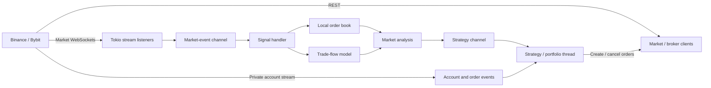

# Rust Algotrader

A performance-oriented algorithmic trading system written in Rust, built as a personal systems-engineering project around real-time exchange data, local market state, order lifecycle management, and concurrent event processing.

This repository is a public, partially redacted snapshot of a larger private project. Its purpose is to demonstrate engineering work in Rust and trading-system architecture; it is **not** presented as production trading software or as a profitable trading strategy.

## What the project demonstrates

- **Direct exchange integration** with Binance and Bybit backends, using REST and WebSocket APIs for market data, account state, and order-related events.
- **Concurrent event processing** with Tokio for asynchronous network I/O and channels/worker threads for separating ingestion, market-state modeling, and strategy execution.
- **Local order-book maintenance** from snapshots and incremental updates, including sequence tracking, stale-update rejection, best bid/ask state, spread calculation, and per-level liquidity.
- **Trade-flow modeling and analysis** built around rolling market events and statistics used by downstream strategy logic.
- **Order and portfolio state management** for resting orders, cancels, fills, account updates, positions, and strategy-side state transitions.
- **Decimal arithmetic for financial values** using 128-bit decimal types rather than binary floating point for prices, quantities, and related calculations.
- **Performance-oriented build/runtime choices**, including LTO, a single release codegen unit, `panic = "abort"`, mimalloc, and timing instrumentation carried from market-data ingress through the processing pipeline.
- **Authenticated exchange communication** using TLS, environment-based credentials, and HMAC-SHA256 signing support.

## Architecture

The project separates network I/O from market-state processing and strategy execution. Market-data streams feed a centralized model of the order book and trade flow; processed model events are then forwarded to the strategy/portfolio layer. Private account events are routed to the strategy state separately.



At startup, the Binance path creates asynchronous listeners for depth, aggregate trades, best-book updates, and private user data. A dedicated signal-processing loop owns the order-book/trade-flow models and emits derived model messages to the strategy thread. This keeps exchange ingestion, model mutation, and strategy state separated by explicit message boundaries.

## Repository layout

```text
src/
├── backend/        Exchange-specific REST/WebSocket integrations
│   ├── binance/
│   └── bybit/
├── orderbook/      Local order-book representation and update logic
├── tradeflow/      Trade-flow state and rolling metrics
├── analysis/       Derived market analysis
├── signal_handler/ Market-event processing pipeline
├── strategy/       Strategy, portfolio, order, and position state
└── config.rs       Environment-driven configuration

dec/                Decimal arithmetic support
logging/            Logging support
proc_macros/        Project procedural macros
```

## Some implementation details

### Market-data pipeline

The exchange listeners deserialize WebSocket messages at ingress and timestamp them before forwarding them into the processing pipeline. The signal handler maintains the mutable market model and forwards derived events to the strategy layer rather than sharing the order book directly across every component.

### Order book

The order book stores bid and ask levels in ordered maps using decimal price keys. Snapshot and incremental update paths track exchange sequence information, reject stale updates, update per-level volume/liquidity, and maintain top-of-book state such as best bid, best ask, and spread.

### Concurrency model

The system deliberately mixes asynchronous I/O and dedicated synchronous processing:

- Tokio runtimes handle exchange WebSocket/REST activity.
- Tokio MPSC channels move raw market events from asynchronous listeners into the model loop.
- Crossbeam channels connect model/account events to the strategy layer.
- Dedicated threads own the central model loop and strategy state.

The goal was to experiment with explicit ownership boundaries and message passing rather than putting a shared lock around all trading state.

### Numeric representation

Prices and quantities use `D128`/Decimal128 arithmetic. This avoids the base-2 representation error associated with ordinary binary floating-point values such as `f64` when exact decimal values matter.

### Performance work

The release profile is configured for whole-program optimization (`lto = "fat"`) and a single codegen unit, and the project uses mimalloc as its global allocator. Timing values are captured at WebSocket ingress and propagated through processing code to make end-to-end pipeline measurements possible during development.

## Running the project

### Requirements

- Rust + Cargo
- A nightly Rust toolchain (the project uses a nightly feature)
- Testnet API credentials for the exchange path you want to exercise

The checked-in `rust-toolchain.toml` names a Windows MSVC nightly toolchain. On another host, edit/remove that file and select an appropriate nightly toolchain for your platform.

### Test configuration

Start with the supplied test environment template:

```bash
cp .env_test.sample.sh .env_test.sh
```

Populate the required API keys, then load it into your shell:

```bash
source .env_test.sh
```

Do **not** commit a populated environment file or real exchange credentials.

The primary configuration is environment-driven. `ENV` selects test/production configuration, and `EXECUTION_MODE` can select alternate entry points. In the current public snapshot, `BYBIT` selects the Bybit automated path, `PING` runs the latency/ping utility, and the default automated path is Binance.

Build and run with release optimizations:

```bash
cargo run --release
```

Exchange APIs, testnet endpoints, symbols, and payload formats change over time, so the checked-in configuration may require updates before the project will run against current services.

## Project status

This is portfolio/research code, not production infrastructure. Portions of the strategy have been intentionally redacted from the public repository, and several operational concerns that would be mandatory in a live trading system are incomplete or deliberately outside the scope of this snapshot. In particular, comprehensive recovery/reconnection behavior, complete sequence-gap recovery, exhaustive testing, observability, and production risk controls should not be assumed from this repository.

Use exchange test environments when experimenting with the code. Nothing in this repository is financial advice, and it should not be used to trade real funds without substantial review, testing, and hardening.

## Why I built it

I built this project to learn Rust in a demanding domain where networking, concurrency, numeric correctness, state synchronization, and performance all matter at the same time. The interesting part for me was less the trading strategy itself and more the engineering problem: continuously ingesting live exchange events, maintaining coherent local state, separating concurrent components cleanly, and measuring the cost of moving data through the system.

## License

GPL-3.0. See `LICENSE.md`.
